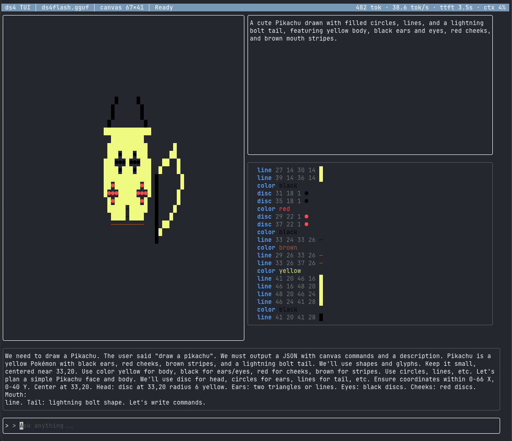
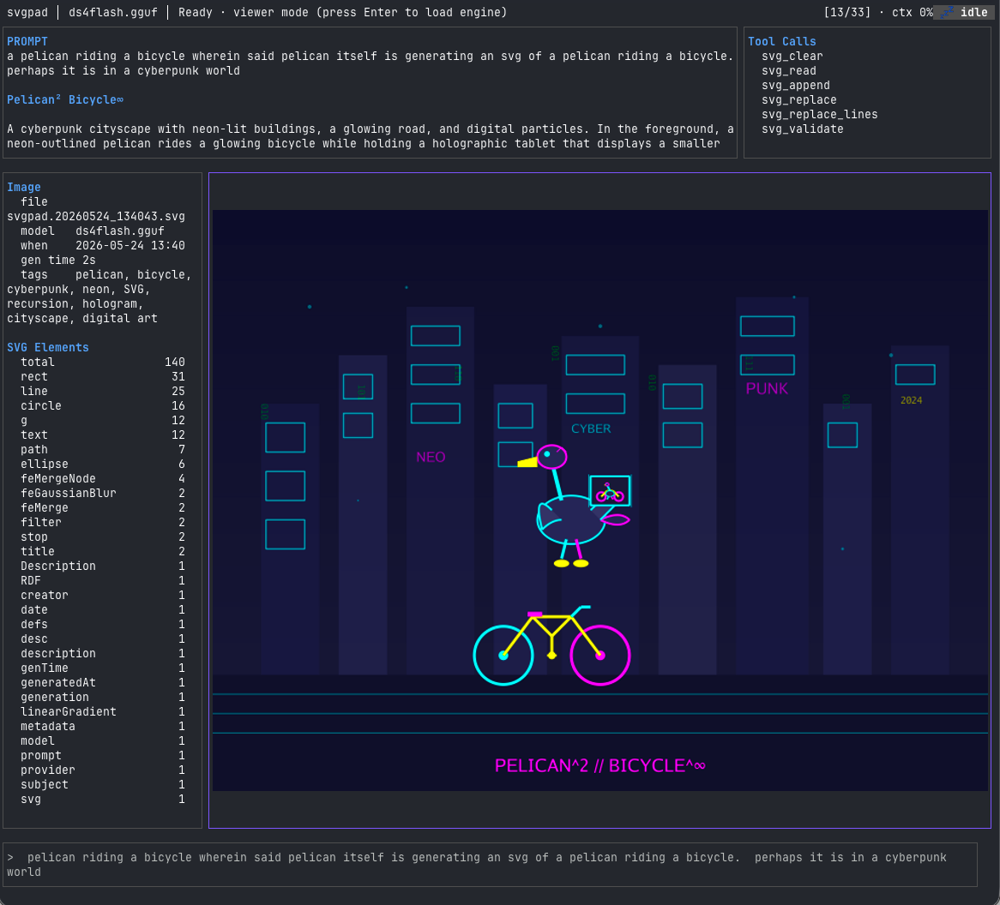
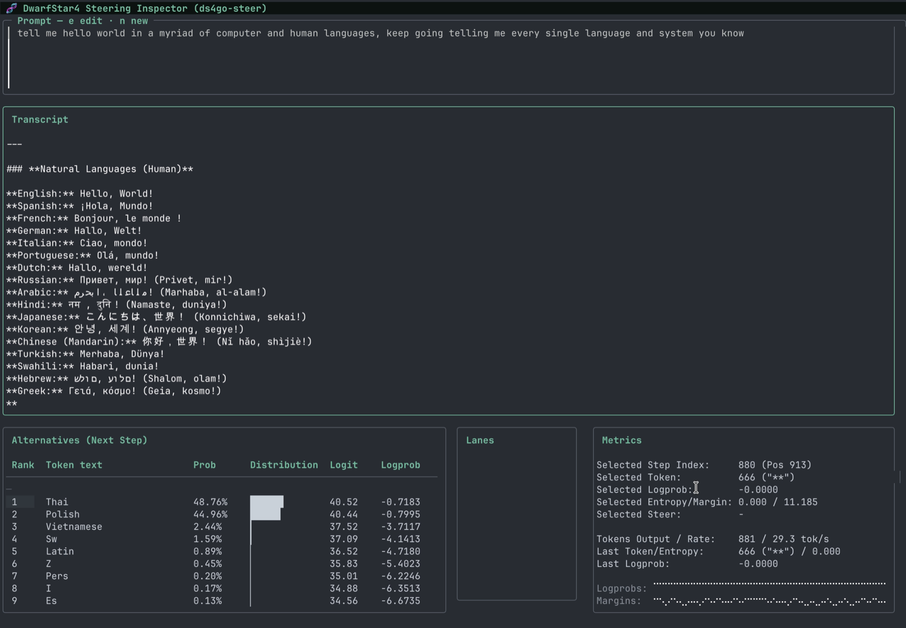

# ds4go-apps

> **Experimental.** [ds4go](https://github.com/NimbleMarkets/ds4go) and our binary builds are carefully maintained, but this repository is experimental. Flags, keys, and behavior can change.

Terminal apps that run DeepSeek models locally through [ds4go](https://github.com/NimbleMarkets/ds4go), a Go binding for the [`ds4` inference engine](https://github.com/antirez/ds4). They draw SVGs and glyph art, build CAD models, animate shaders, and explore activation steering. Inference runs on Metal on macOS, CUDA on Linux, or the CPU.

---

## Applications

| App | Binary | What it does |
|-----|--------|--------------|
| **glyphpad** | `ds4go-glyphpad` | Unicode and ASCII art. Ask the model to generate and edit characters, blocks, and symbols on a canvas. |
| **[svgpad](cmd/svgpad/README.md)** | `ds4go-svgpad` | SVG drawing. Describe an image, and the model writes SVG that is rendered in the terminal. With a vision model it reviews its own renders. |
| **[cadpad](cmd/cadpad/README.md)** | `ds4go-cadpad` | 3D CAD. The model builds solids with tool calls (create, transform, boolean) on a signed-distance-field engine, with live previews. Runs without a model as a Go geometry harness. |
| **[trippad](cmd/trippad/README.md)** | `ds4go-trippad` | Live WGSL shaders with parameter sliders and GPU animation. The model can edit the shader. Also runs in a browser with WebGPU. Works without a model. |
| **steering** | `ds4go-steering` | Activation-steering dashboard. Adjust FFN and attention steering vectors, branch timelines, and look at token logits. |

---

## Demos and screenshots

- [DS4 Playground](https://gist.github.com/neomantra/ae47422c8daf7a458212c93992b3e078): svgpad, glyphpad, cadpad, and steering at work, including a pelican drawn as SVG, a Pikachu from a glyph script, and a CAD model written as Lua.
- [Demo videos](https://gist.github.com/neomantra/d49df05d6b137b9e6844186499715756): steering "hello world", the svgpad pelican, ds4 in Charm `crush`, and the `dankbot420` demo.
- [ds4go CLI screenshots](https://gist.github.com/neomantra/40180ade13df93290250ce8c6d28c9f6): the underlying `ds4go` command's model list, model download, and validate output.

The screenshots were taken at different times and may not match the current UI.

---

## Requirements

- **Go 1.26.8 or newer**, and [Task](https://taskfile.dev).
- **libds4 and a model.** Install them with ds4go. `ds4` needs 128 GB or more of GPU memory.
- **A GPU driver.** Metal on macOS. On Linux, cadpad and trippad use Vulkan for their GPU views.
- **A terminal with Kitty graphics** (Kitty, Ghostty, WezTerm) to see images. Other terminals fall back to character rendering.
- **A browser with WebGPU**, only for the trippad browser playground.

These apps use ds4go v0.8.0, which needs libds4 v0.5.20260910 or newer. Some features need a newer libds4:

| Feature | libds4 |
|---------|--------|
| DeepSeek V4.1 and think levels | v0.6.20260912 |
| DGX Spark (GB10): the `linux-arm64-gb10-cuda` asset | v0.6.20260913 |
| Qwen3.8 Flash Next, and the low and medium reasoning modes | v0.7.20260918 |

---

## Build

The module builds against the published ds4go and ntcharts releases. No workspace or local checkouts are needed.

```bash
task build              # all apps
task build:glyphpad     # or one app: svgpad, cadpad, trippad, trippad-memory, steering
```

Binaries go to `./bin/`. Builds use `-mod=readonly` and skip apps whose inputs have not changed. Run `task tidy` after changing dependencies, and `task --force build` to rebuild everything. If a compile fails, the previous binary is kept. Build state is kept in the ignored `.task/` directory.

On Linux the Taskfile builds with `CGO_ENABLED=0` and `-tags=nofakecgo`, which shares purego's FFI runtime with goffi. No OpenGL headers are needed. To build cadpad directly:

```bash
CGO_ENABLED=0 go build -tags=nofakecgo -o bin/ds4go-cadpad ./cmd/cadpad
```

`task run:<app>` picks the inference backend automatically. Set `BACKEND=cuda`, `BACKEND=metal`, or `BACKEND=cpu` to override it.

---

## Running the apps

### glyphpad

```bash
task run:glyphpad
# or directly
./bin/ds4go-glyphpad --backend metal --ctx 32768
```

Type a prompt to generate Unicode patterns, box-drawing diagrams, or pixel-art blocks. **Ctrl+E** opens the edit box to refine a selection. Copying the canvas copies the complete glyph grid.



### svgpad

```bash
task run:svgpad
```

Describe an image and the model writes SVG. See the [svgpad README](cmd/svgpad/README.md) for visual review, the model picker, headless mode (`--prompt`), and context handling.



### cadpad

```bash
task run:cadpad
# pure geometry, no model
NO_ENGINE=1 task run:cadpad
```

Operations are stored as a replayable JSON log, so every create, transform, and boolean can be undone and saved. An example session, `examples/cadpad/demo.cad.json`:

```json
[
  {"kind":"create",  "args":{"name":"base","shape":"box","params":{"x":10,"y":8,"z":2}}},
  {"kind":"create",  "args":{"name":"post","shape":"cylinder","params":{"r":1,"h":6}}},
  {"kind":"transform","args":{"name":"post","op":"translate","args":{"x":0,"y":0,"z":4}}},
  {"kind":"boolean",  "args":{"op":"union","target":"base","source":"post","blend_radius":0.3}}
]
```

Escape cancels the current run, and switching models keeps the CAD world. The viewport copy is a text description of the world. See the [cadpad README](cmd/cadpad/README.md).


### trippad

```bash
task run:trippad
# no model
./bin/ds4go-trippad --no-engine
```

See the [trippad README](cmd/trippad/README.md) for the controls, the shader gallery, and the browser playground.

### steering

```bash
task run:steering -- --dir-steering ./my-vectors --scale 0,1,-1
```

Shows how steering vectors shift next-token probabilities. You can branch timelines, change FFN scales while running, and compare outputs side by side.



### Shared keys

glyphpad, svgpad, and cadpad share these keys:

| Key | Action |
|-----|--------|
| **F1** | Help |
| **F2** | Run settings |
| **Ctrl+R** | Cycle reasoning |
| **Ctrl+O** | Choose a model |
| **Ctrl+Y** | Copy the focused pane |
| **Tab / Shift+Tab** | Move focus, including to the prompt |
| **Ctrl+N** | Logs |

Settings changed during inference apply to the next request, and settings are locked while a model loads. The engine loads lazily and keeps queued prompts while it loads. Copying uses OSC 52, so your terminal has to allow clipboard writes.

---

## Browser playground

trippad can serve a WebGPU version of its shaders:

```bash
./bin/ds4go-trippad --web-only                  # http://127.0.0.1:8080/, no model or native GPU
./bin/ds4go-trippad --no-engine --web           # alongside the terminal UI
```

A small Go `net/http` server serves embedded HTML, JavaScript, and CSS. The browser runs the same WGSL compute module that the terminal app builds, using plain JavaScript and the WebGPU API. There is no Go-to-WASM build and no JavaScript framework. The server only accepts loopback addresses and checks the Host header. Its pages load nothing from other origins. Details are in the [trippad README](cmd/trippad/README.md).

---

## Common flags

These apply to glyphpad, svgpad, cadpad, and trippad (a flag that does not apply to an app is noted below).

| Flag | Default | Meaning |
|------|---------|---------|
| `-m, --model` | `$DS4_DIR/models/ds4flash.gguf` | Installed model alias or GGUF path |
| `--ctx` | 32768 (cadpad 16384, trippad 131072) | Context window in tokens |
| `--backend` | auto | `metal`, `cuda`, or `cpu` |
| `--power` | 100 (cadpad 80) | GPU duty-cycle throttle, 1 to 100 percent |
| `--temp` | 0.7 | Sampling temperature. `0` is greedy. |
| `--top-p` | 0.95 | Nucleus sampling cutoff |
| `--seed` | 0 | Sampler seed. `0` uses a new seed for each request. |
| `--tool-rounds` | svgpad 20, cadpad 36, trippad 20 | Tool-call rounds per request. The final answer gets one extra turn. |
| `-d, --debug` | off | Log raw model traffic and libds4 diagnostics to a `*.log` file |
| `--ssd-streaming` | off | Stream experts from SSD |
| `--lib` | search path | Path to the libds4 shared library |

`--tool-rounds` is not in glyphpad. `--no-engine` starts without a model and is in cadpad and trippad.

steering takes `--model`, `--ctx`, `--backend`, `--seed`, `--temp`, `--top-p`, and `--lib`, with `--temp` and `--top-p` defaulting to 1. It adds `--dir-steering` (directory with the `vectors.json` registry), `--scale` (comma-separated FFN scales), `--attn-scale`, `--allow-attn-steering`, `--top-k`, and `--max-tokens`. Run any app with `--help` for its full list.

### Kitty frame transport

`--kitty-transport` (cadpad and trippad, default `auto`) sets how image frames reach the terminal:

- **`png`**: PNG through the terminal stream. Works everywhere Kitty graphics work, including SSH.
- **`rgba`**: raw pixels through the stream. No PNG encode, but about 5.3 bytes per pixel go over the wire.
- **`shm`**: raw pixels through shared memory, so only a short reference goes through the terminal. It needs a local terminal that supports Kitty's shared-memory medium (`t=s`), such as Kitty or Ghostty. The app uses shared memory once the terminal answers a startup probe, sends PNG until then and whenever an object cannot be created, and logs that fallback once.
- **`auto`**: makes the same request as `shm` but does not report a PNG result, since that is expected over SSH or in a terminal without `t=s`.

cadpad's viewport header names the transport once it is not plain PNG. If the viewport stays blank, run with `--kitty-transport png`.

---

## Project layout

```
.
├── cmd/
│   ├── glyphpad/         Unicode glyph app
│   ├── svgpad/           SVG drawing app
│   ├── cadpad/           CAD app and headless harness
│   ├── trippad/          shader app and browser playground
│   ├── trippad-memory/   command-line access to trippad's notes
│   └── steering/         activation-steering dashboard
├── internal/
│   ├── appinit/          shared app startup
│   ├── bubble/           model tool-loop driver for Bubble Tea
│   ├── cadpad/           CAD world, SDF operations, rendering, Lua
│   ├── cliopts/          shared command-line flags
│   ├── ds4log/           libds4 diagnostic capture
│   ├── editmode/         shared edit box and key actions
│   ├── engineinit/       engine and GPU readiness lifecycle
│   ├── headerbar/        one-line header layout
│   ├── modelpicker/      installed-model picker widget
│   ├── padui/            dialogs, pager, and Kitty transport shared by the pads
│   ├── runconfig/        run settings and budget guidance
│   ├── steerinspect/     steering vector inspection and diffs
│   ├── steertui/         steering dashboard views
│   └── trippad/          shaders, parameters, tools, gallery, web server
├── ntgpu/                GPU compute helpers on wgpu
├── examples/cadpad/      sample .cad.json sessions
├── scripts/              WGSL language server installer, svgpad benchmark
├── .github/workflows/    CI and release
├── Taskfile.yml          build and run tasks
├── AGENTS.md             notes for coding agents working on the repo
└── PAD-ROLLOUT.md        status of features shared across the pads
```

---

## Libraries

| Area | Libraries | Used for |
|------|-----------|----------|
| Terminal UI | [Bubble Tea v2](https://github.com/charmbracelet/bubbletea), [Bubbles v2](https://github.com/charmbracelet/bubbles), [Lipgloss v2](https://github.com/charmbracelet/lipgloss), [ultraviolet](https://github.com/charmbracelet/ultraviolet), [x/ansi](https://github.com/charmbracelet/x), [stickers](https://github.com/76creates/stickers) | UI, input, styling, terminal events, ANSI handling, flexbox layout |
| Terminal graphics | [ntcharts](https://github.com/NimbleMarkets/ntcharts), [ntcharts-svg](https://github.com/NimbleMarkets/ntcharts-svg), [oksvg](https://github.com/NimbleMarkets/oksvg), [ntdiff](https://github.com/NimbleMarkets/ntdiff) | Kitty picture widget, SVG rendering (oksvg is our fork of srwiley/oksvg), steering diffs |
| Inference | [ds4go](https://github.com/NimbleMarkets/ds4go), [ds4](https://github.com/antirez/ds4), [purego](https://github.com/ebitengine/purego) | Local models; calling libds4 without cgo |
| GPU | [gogpu/wgpu](https://github.com/gogpu/wgpu), gputypes, [naga](https://github.com/gogpu/naga) | WebGPU in pure Go (Metal, Vulkan). cadpad's raymarcher and trippad's shaders run on it. naga compiles and validates WGSL. |
| CAD | [gsdf](https://github.com/soypat/gsdf) and geometry, [gopher-lua](https://github.com/yuin/gopher-lua), [go3mf](https://github.com/hpinc/go3mf), [math32](https://github.com/chewxy/math32) | Signed-distance-field geometry, Lua scripting by the model, 3MF export |
| Other | [chroma](https://github.com/alecthomas/chroma), [cobra](https://github.com/spf13/cobra), [pflag](https://github.com/spf13/pflag) | Syntax highlighting; flags (cobra for steering, pflag for the rest) |
| Browser | `net/http`, plain JavaScript, WebGPU | trippad's playground, no frameworks |

Optional tools outside `go.mod`: [`lua-language-server`](https://github.com/LuaLS/lua-language-server) for cadpad's Lua editing support, and a [`wgsl-analyzer`](https://github.com/NimbleMarkets/wgsl-analyzer) build for trippad's WGSL checks (`scripts/install-trippad-wgsl-lsp.sh` installs a pinned macOS binary).

---

## Development

```bash
task test        # tests
task pre-push    # format check before pushing
task log         # follow logs while an app runs
```

If you run out of VRAM, lower the context or power: `task run:svgpad -- --ctx 8192 --power 50`.

GPU tests need a real GPU and do not run under `-race`. CI runs the full suite on macOS and the pure-Go packages on Linux.

---

## Acknowledgements

Thanks to [@antirez](https://github.com/antirez) for [`ds4`](https://github.com/antirez/ds4) and for his local-LLM advocacy, and to [DeepSeek](https://www.deepseek.com/) for their public contributions.

## License

Released under the [MIT License](https://en.wikipedia.org/wiki/MIT_License). See [LICENSE.txt](./LICENSE.txt).

Copyright (c) 2026 [Neomantra Corp](https://www.neomantra.com).

----
Made with :heart: and :fire: by the team behind [Nimble.Markets](https://nimble.markets).
