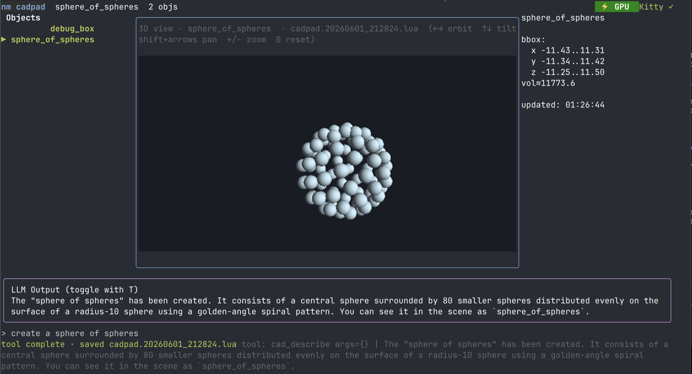

# cadpad: CAD scratchpad

`ds4go-cadpad` is a terminal CAD app. You describe what you want, and the model changes a live `simplesdf` world through ds4go tool calls (DSML). Previews are drawn on the CPU and shown with `ntcharts/v2/picture`.

It is the geometry counterpart to `svgpad` and `glyphpad`.



## Features

- **Tools:** `cad_create`, `cad_boolean`, `cad_transform`, `cad_group`, `cad_export_stl`, `cad_render_preview`, `cad_describe`, `cad_bbox`, and `cad_save`/`cad_load`.
- **Midplane previews:** drawn with `glrender.NewImageRendererSDF2` and projection adapters (XY, XZ, YZ). Typically under 80 ms on a laptop CPU.
- **GPU 3D viewport:** the angled 3D view raymarches the SDF on the GPU (through `gogpu`/`wgpu`, Metal on macOS) when a hardware device is available. Otherwise it uses the CPU mesh preview. The `3D·GPU` or `3D·CPU` badge in the viewport header shows which one is active.
- **Picture output:** images use Kitty graphics where the terminal supports them, and glyphs otherwise. `--kitty-transport png|rgba|shm|auto` sets how Kitty frames are sent. The default, `auto`, uses shared memory when the terminal confirms it and PNG otherwise. The viewport header names the transport once it is not plain PNG, and names a PNG fallback from an explicit `rgba` or `shm` request.
- **Replayable history:** `.cad.json` files are arrays of the same operations the model used.
- **Headless mode:** `--no-engine` starts immediately for Go geometry scripting, or embed the `harness` package.
- **Errors:** uses `simplesdf.Err()` and `ClearErrors()`. If GPU preview or export is unavailable, cadpad falls back to the CPU path.

## Quick Start

```bash
# Build
task build:cadpad

# Run (will auto-load the default ds4 model)
./bin/ds4go-cadpad

# Pure geometry mode (no LLM, instant start, slash commands only)
./bin/ds4go-cadpad --no-engine
```

## Keyboard Shortcuts

| Key          | Action                              |
|--------------|-------------------------------------|
| `Enter`      | Submit LLM prompt / set current     |
| `j` / `k`    | Navigate object list                |
| `Tab` / `1`/`2`/`3` | Cycle XY / XZ / YZ projection |
| `p`          | Force refresh preview               |
| `r`          | Clear render cache + refresh        |
| `s`          | Quick-save `cadpad-session.cad.json`|
| `?` / `h`    | Toggle help                         |
| `q` / `Ctrl-C` | Quit                              |

## Slash Commands (work even without engine)

```
/clear
```

Most modeling now happens through natural language + the `lua_*` file tools (the LLM writes and runs `.lua` scripts using low-level `sdf.*` primitives). `s` in the TUI saves both the JSON replay + a timestamped `cadpad.*.lua` snapshot.

## LLM Prompt Examples

```
"create a 12x10x3 base plate with chamfered edges"
"add four 8mm posts at the corners"
"drill a 3mm through-hole in the center"
"round everything with a 0.4 blend"
"save this as enclosure.cad.json"
"what is the bounding box of the current object?"
```

The LLM primarily works by writing and running `.lua` files using the low-level `sdf` module (via the `lua_*` tools). After a successful generation the TUI automatically writes a time-dated artifact:

```
cadpad.20060102_150405.lua
```

(Exactly like svgpad writes `svgpad.20060102_150405.svg` on success.)

Manual save with `s` also writes both the JSON history and a fresh timestamped `.lua` snapshot.

## File Formats

- `.cad.json` — replayable history (array of op records). Load with `/load` or the `World.Load` API.
- `.stl` — exported via `SDF3.SaveSTL` (CPU by default; GPU path available in harness users).

## Architecture (for contributors)

```
cmd/cadpad/
  main.go     — flags, engine bootstrap, TUI launch, graceful stderr squelch
  tui.go      — Bubble Tea model, layout, slash commands, ToolLoop integration
internal/cadpad/
  world/      — named SDF3 store + history log + save/load replay
  render/     — SDF3→SDF2 projectors + glrender.ImageRendererSDF2 + LRU
  tools/      — the 10 atomic handler funcs (CreatePrimitive, BooleanOp, …)
  harness/    — RegisterAll(reg, world, renderer) — one-liner integration
```

## Embedding / Headless Tool Server

```go
import (
    "github.com/NimbleMarkets/ds4go"
    "github.com/NimbleMarkets/ds4go-apps/internal/cadpad/harness"
    "github.com/NimbleMarkets/ds4go-apps/internal/cadpad/render"
    "github.com/NimbleMarkets/ds4go-apps/internal/cadpad/world"
)

w := world.NewWorld()
r, _ := render.NewRenderer(render.DefaultPreviewConfig)
reg := ds4.NewToolRegistry()
harness.MustRegisterAll(reg, w, r)

// Now use reg with ToolLoop or ds4 server exactly like any other tools.
```

## Building & Running (Taskfile)

```bash
task build:cadpad
task run:cadpad          # with default model
task run:cadpad MODEL=/path/to/other.gguf BACKEND=cpu
```

## Tests

Core machinery has focused unit/smoke tests (no GPU or display required):

```bash
go test ./internal/cadpad/lua/...      # Lua bindings (primitives, chaining, register, functions/loops, errors, require("sdf"))
go test ./internal/cadpad/render/...   # Projection, rendering, caching, size computation via glrender CPU path
go test ./internal/cadpad/world/...    # Existing world ops + save/load
go test ./cmd/cadpad/...               # TUI model integration (no-engine path, render through the model, etc.)
```

These cover the two areas most critical for reliable LLM-driven CAD: the low-level Lua→simplesdf bridge and the fast headless preview renderer.

## Requirements

- Go 1.26+
- (optional but recommended) A DS4 GGUF model + libds4 for full LLM experience
- Terminal with Kitty graphics or sixel (glyph fallback always works)

## License

Same as the rest of ds4go-apps (see root).

## Status

Alpha. The core loop, tools, rendering pipeline, and slash-command fallback are complete and usable for iterative modeling. Expect rapid iteration on the exact tool surface and preview quality.
